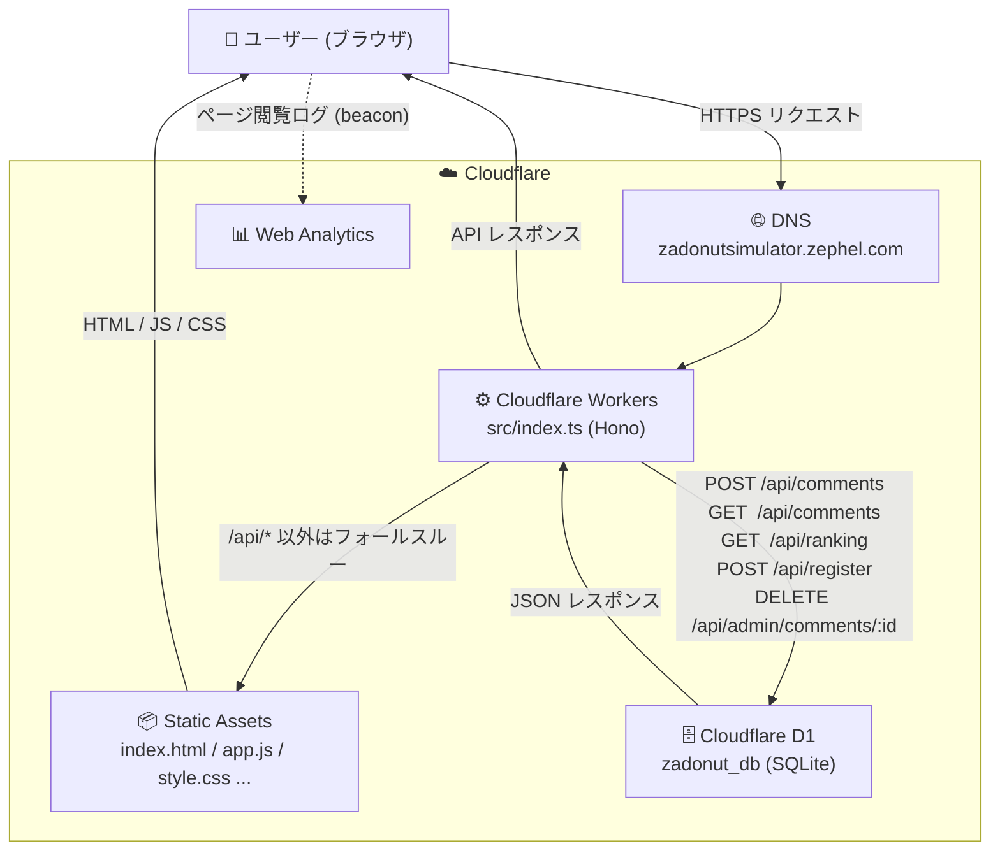

# 🍩 Pokemon Legends ZA — ドーナツシミュレーター

> Pokemon Legends ZA 向けのドーナツレシピ調合シミュレーター。  
> きのみの組み合わせによって変化するドーナツの効果・持続時間・フレーバーパワーをリアルタイムで計算し、最適なレシピを探せます。

[](./version.js)
[](https://www.typescriptlang.org/)
[](https://hono.dev/)
[](https://workers.cloudflare.com/)
[](#license)
[](https://zadonutsimulator.zephel.com/)

---

## ✨ 機能一覧

| 機能 | 説明 |
|------|------|
| **リアルタイムシミュレーション** | きのみを最大8個選ぶだけで即座にドーナツ結果を計算 |
| **最適レシピ探索** | 「かがやきパワーLv2-3」など目標パワーに合う組み合わせを10,000回探索 |
| **伝説ドーナツ検索** | ナイトメアクルーラー・オールドファッションシリーズなど特別なドーナツのレシピを検索 |
| **レーダーチャート** | 5フレーバー（スイート・スパイシー・サワー・ビター・フレッシュ）を視覚化 |
| **人気ランキング** | コミュニティの人気レシピをリアルタイムで集計・表示 |
| **コメント機能** | レシピごとにコメントを投稿・閲覧 |
| **レシピ画像保存** | html2canvas でレシピをワンクリック画像化 |
| **Pythonマクロ生成** | TARGETS配列対応のスクリプトを自動生成・ダウンロード |
| **SNS共有** | X / LINE / Facebook へのシェアに対応 |
| **ダーク / ライトモード** | テーマ切り替え対応 |

---

## 🛠 技術スタック

```
Frontend:  HTML5 · CSS3 · Vanilla JavaScript
Charts:    Canvas API (Radar Chart)
Images:    html2canvas
Fonts:     Google Fonts (Inter)
Backend:   Cloudflare Workers · Hono v4 · TypeScript v5
Database:  Cloudflare D1 (SQLite)
Deploy:    Wrangler CLI v4
```

---

## ☁️ Cloudflare 利用構成



---

## 📁 ファイル構成

```
.
├── index.html       # メインUI・レイアウト
├── style.css        # デザイン・アニメーション
├── app.js           # UIロジック・イベント処理
├── simulator.js     # ドーナツ計算・探索アルゴリズム
├── data.js          # きのみデータ・ドーナツ定義
├── version.js       # バージョン管理
├── wrangler.jsonc   # Cloudflare デプロイ設定
├── package.json     # 依存関係
├── tsconfig.json    # TypeScript 設定
├── src/
│   └── index.ts     # Cloudflare Workers API (Hono + TypeScript)
└── schema.sql       # D1 データベーススキーマ
```

---

## 🚀 Cloudflare Workers へのデプロイ手順

### 必要なもの

- [Node.js](https://nodejs.org/) v18 以上
- [Cloudflare アカウント](https://dash.cloudflare.com/sign-up)（無料枠で動作します）

### 1. リポジトリをクローン

```bash
git clone https://github.com/YOUR_USERNAME/ZADounutSimulator.git
cd ZADounutSimulator
```

### 2. 依存パッケージをインストール・ログイン

```bash
npm install
npx wrangler login
```

### 3. D1 データベースを作成

```bash
npx wrangler d1 create zadonut_db
```

コマンド実行後に表示される `database_id` を `wrangler.jsonc` に貼り付けます。

```jsonc
"d1_databases": [
  {
    "binding": "DB",
    "database_name": "zadonut_db",
    "database_id": "xxxxxxxx-xxxx-xxxx-xxxx-xxxxxxxxxxxx"  // ← ここ
  }
]
```

### 4. スキーマを適用

```bash
npx wrangler d1 execute zadonut_db --remote --file=./schema.sql
```

### 5. 管理者キーをシークレットとして登録

> ⚠️ `ADMIN_KEY` は **絶対にコードやファイルに直接書かないでください**。

```bash
npx wrangler secret put ADMIN_KEY
```

プロンプトが出るので任意のキーを入力してください。

### 6. デプロイ

```bash
npm run deploy
```

デプロイ後、`https://zadonutsimulator.<your-subdomain>.workers.dev` でアクセスできます。

---

## 💻 ローカル開発

ローカル D1 にスキーマ適用（初回のみ）：

```bash
npx wrangler d1 execute zadonut_db --local --file=./schema.sql
```

ローカルサーバー起動：

```bash
npm run dev
```

`http://localhost:8787` でアクセスできます。

型チェック：

```bash
npm run type-check
```

---

## 🔒 セキュリティについて

- `ADMIN_KEY` は `wrangler secret` で管理し、リポジトリにはコミットしないこと
- `database_id` は公開 URL の特定に使われる可能性があるため、`YOUR_D1_DATABASE_ID` プレースホルダーのままにしておくこと
- 本番環境への反映後、[Cloudflare Dashboard](https://dash.cloudflare.com/) で Workers の「Settings → Variables」からも確認できます

---

## 📝 使い方

1. **きのみ選択** — グリッドからきのみをタップして追加（最大8個）
2. **結果確認** — 右パネルにドーナツ名・レベル・持続時間・候補パワーが表示
3. **探索** — 「ドーナツ検索」タブで目的別プリセット（素材稼ぎ・色違い厳選など）を使って最適な組み合わせを探索
4. **保存・共有** — 「保存」ボタンでレシピをブラウザに記録、SNSボタンで共有

---

## 📄 License

MIT License — 自由に使用・改変・再配布できます。

---

*Created by [くーるぜろ](https://note.com/zephel01)*
